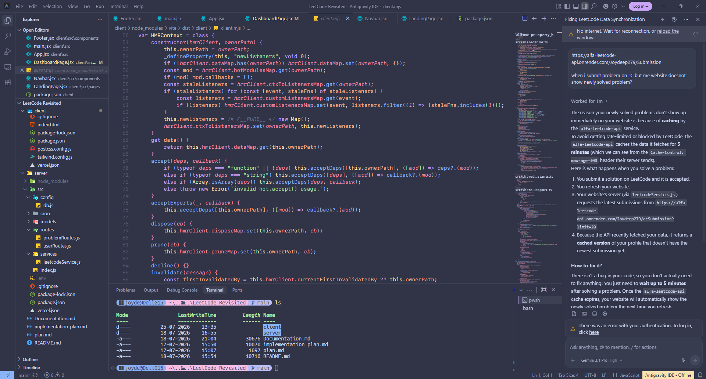
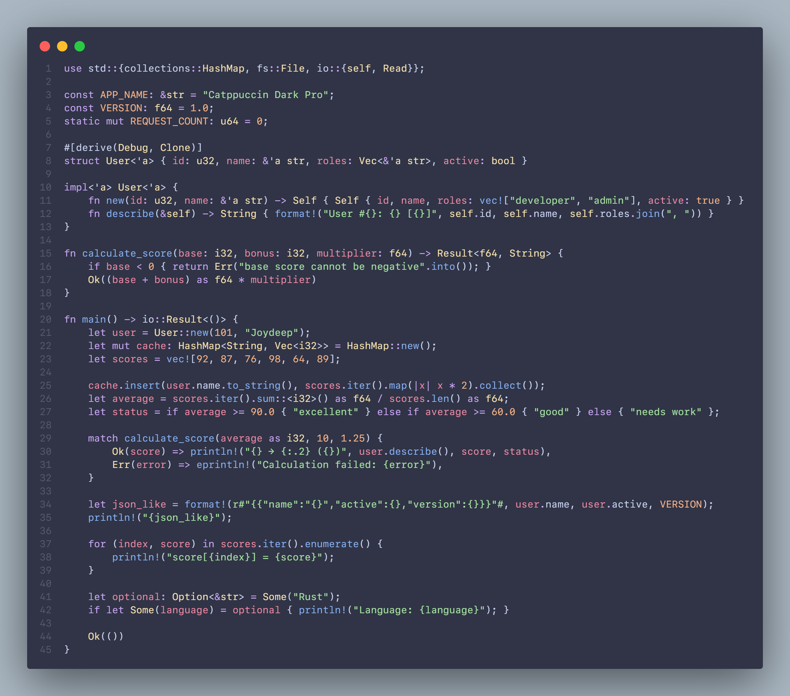

<div align="center">


#  Catppuccin Pro

**A refined dark theme for Visual Studio Code — born from the elegance of [Catppuccin](https://github.com/catppuccin/catppuccin) and the clarity of [One Dark Pro](https://github.com/Binaryify/OneDark-Pro).**

[](https://marketplace.visualstudio.com/items?itemName=Joydeep.catppuccin-pro)
[](https://marketplace.visualstudio.com/items?itemName=Joydeep.catppuccin-pro)
[](./LICENSE)

</div>

---

## ✨ About

**Catppuccin Pro** takes the soothing pastel palette of Catppuccin Mocha and combines it with the carefully tuned syntax highlighting and flat, minimal UI philosophy of One Dark Pro. The result is a theme that's easy on the eyes during long coding sessions while keeping your code sharp and readable.

### Why Catppuccin Pro?

- 🎨 **Catppuccin's pastel palette** — warm, balanced colors that reduce eye strain
- 🧩 **One Dark Pro's syntax clarity** — thoughtful token coloring that makes code structure instantly scannable
- 🪟 **Ultra-flat UI** — no distracting shadows or borders; just clean, borderless panels
- ✍️ **Semantic highlighting** — richer, context-aware coloring for supported languages
- 🌙 **Designed for dark mode** — deep background (`#303446`) with soft foreground text (`#cdd6f4`)

---

## 📸 Preview

### Editor

> The full VS Code experience — flat UI, borderless panels, and Catppuccin Mocha colors throughout.

<div align="center">
  
</div>

### Syntax Highlighting

> Rust syntax highlighting with pastel-colored keywords, functions, types, and strings.

<div align="center">
  
</div>

---

## 🚀 Installation

### From the VS Code Marketplace

1. Open **Extensions** in VS Code (`Ctrl+Shift+X`)
2. Search for **Catppuccin Pro**
3. Click **Install**
4. Open the Command Palette (`Ctrl+Shift+P`) → **Preferences: Color Theme** → select **Catppuccin Pro**

### From a `.vsix` file

```bash
code --install-extension catppuccin-pro-1.0.0.vsix
```

---

## 🎨 Color Palette

Catppuccin Pro uses the **Catppuccin Mocha** palette as its foundation:

| Role | Color | Hex |
|---|---|---|
| 🔵 Functions |  Blue | `#89b4fa` |
| 🟣 Keywords |  Mauve | `#cba6f7` |
| 🟢 Strings |  Green | `#a6e3a1` |
| 🟡 Types / Classes |  Yellow | `#f9e2af` |
| 🟠 Properties |  Peach | `#fab387` |
| 🔴 Variables / Params |  Red | `#f38ba8` |
| 🩵 Enum Members |  Teal | `#94e2d5` |
| ⚪ Comments |  Overlay 0 | `#7f849c` |
| 🖥️ Background |  Base | `#303446` |
| 📝 Foreground |  Text | `#cdd6f4` |

---

## 🗂️ Language Support

Catppuccin Pro includes hand-tuned syntax highlighting for a wide range of languages, including:

`JavaScript` · `TypeScript` · `Python` · `Rust` · `Go` · `C / C++` · `Java` · `Dart` · `Ruby` · `PHP` · `HTML` · `CSS / SCSS` · `JSON` · `YAML` · `TOML` · `Markdown` · `Shell` · `SQL` · `Haskell` · `Elixir` and more.

Semantic highlighting is enabled for languages supported by VS Code's language servers.

---

## 🛠️ Recommended Settings

For the best experience, pair the theme with these editor settings:

```jsonc
{
  "editor.fontFamily": "SF Mono",
  "editor.fontLigatures": true,
  "editor.fontSize": 14,
  "editor.cursorBlinking": "smooth",
  "editor.cursorSmoothCaretAnimation": "on",
  "editor.smoothScrolling": true,
  "workbench.list.smoothScrolling": true
}
```

---

## 🤝 Contributing

Found a color that doesn't look right? Have a suggestion for a language that needs better support? Feel free to [open an issue](https://github.com/Joydeep279/Catppuccin-Pro/issues) or submit a pull request!

---

## 📄 License

[MIT](./LICENSE) © [Joydeep Nath](https://github.com/Joydeep279)

---

<div align="center">

**Made with 💜 by [Joydeep Nath](https://github.com/Joydeep279)**

*If you enjoy Catppuccin Pro, consider leaving a ⭐ on [GitHub](https://github.com/Joydeep279/Catppuccin-Pro)!*

</div>
